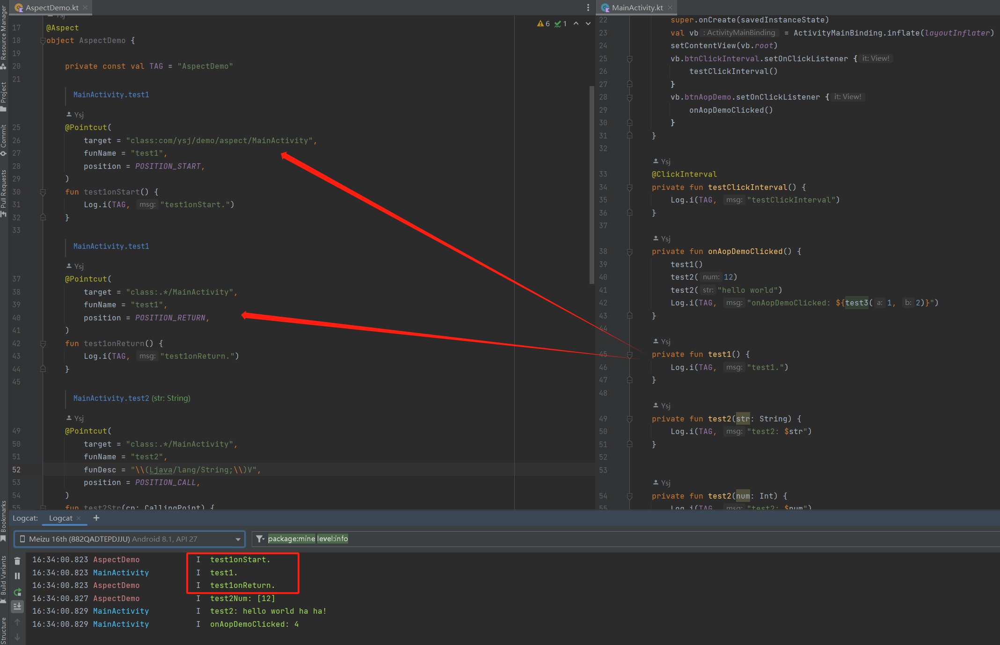

## modifier-aspect

基于 [BCU](https://github.com/Ysj001/BytecodeUtil) 开发的，用于在 Android 中实现 AOP 的字节码修改器。

本库相比 AspectJ 在 Android 上有更好的编译兼容性，可避免编译时产生的各种问题。

- 如果本项目对你有所帮助，欢迎 start。
- 如果有问题或 bug 欢迎提 issues 给我。


### Compile

工程结构如下

- `app` 用于演示
- `buildSrc` 管理 maven 发布和版本控制项目统一配置
- `repos` 本地 maven 仓库，便于开发时调试
- `lib_modifier_aspect` 本项目核心 Modifier 实现
  - `aspect-api` 上层需要使用的 api

在编译本项目前请先在根目录下执行 `gradlew publishAllPublicationsToLocalRepository` 然后重新 sync。


### Quick Start

1. 推荐使用下面所示的最新版本：

   - BCU：[](https://jitpack.io/#Ysj001/BytecodeUtil)
   - modifier-aspect：[](https://jitpack.io/#Ysj001/bcu-modifier-aspect)

2. 在项目的根 `build.gradle.kts` 中配置如下

   ```kotlin
   buildscript {
       repositories {
           maven { setUrl("https://jitpack.io") }
       }
       
       dependencies {
           // BCU 插件依赖
           classpath("com.github.Ysj001.BytecodeUtil:plugin:<lastest-version>")
           // modifier-aspect 依赖
           classpath("com.github.Ysj001:bcu-modifier-aspect:<lastest-version>")
       }
   }
   
   subprojects {
       repositories {
           maven { url 'https://jitpack.io' }
       }
   }
   ```

3. 在 `app` 模块的 `build.gradle.kts` 中的配置如下

   ```kotlin
   plugins {
       id("com.android.application")
       id("org.jetbrains.kotlin.android")
       // 添加 bcu 插件
       id("bcu-plugin")
   }
   
   // 配置 bcu 插件
   bytecodeUtil {
       loggerLevel = 1
       modifiers = arrayOf(
           // 使用 modifier-aspect 的 Modifier 实现
           Class.forName("com.ysj.lib.bcu.modifier.aspect.AspectModifier"),
       )
       notNeed = { entryName ->
           // 请按需配置过滤，可大幅提升编译输速度
           false
       }
   }
   
   dependencies {
       // 依赖 modifier-aspect-api
       implementation("com.github.Ysj001:bcu-modifier-aspect-api:<lastest-version>")
   }
   ```


### API

1.  通过 `Aspect` 注解标记一个类用于处理切面

   ```kotlin
   @Aspect
   object AspectDemo {
   }
   ```

2. 通过 `Pointcut` 注解标记一个切面类中的方法，使其变成切入点

   ```kotlin
   @Aspect
   object AspectDemo {
       @Pointcut(
           target = "class:com/ysj/demo/aspect/MainActivity", // 切入的目标方法所在的类
           funName = "test1", // 切入的目标方法名
           funDesc = ".*." // 切入的目标方法描述，这里的正则表示任意描述
           position = POSITION_START, // 定义切入位置，这里表示在目标方法开始处
       )
       fun test1onStart() {
           Log.i(TAG, "test1onStart.")
       }
   }
   ```

3. 编译运行并查看 log

更详细功能演示可以进入 `app` 的 [AspectDemo](app/src/main/java/com/ysj/demo/aspect/AspectDemo.kt) 中查看，效果如下图所示。




### Projects Using modifier-aspect

- [Android Permission Monitor](https://github.com/Ysj001/PermissionMonitor)：Android 隐私政策敏感权限监控。